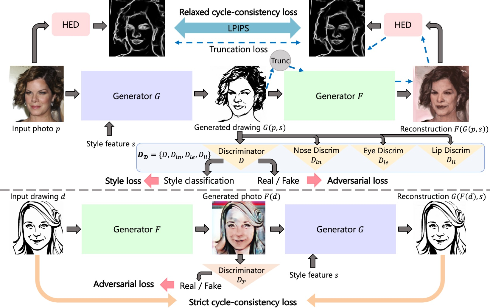
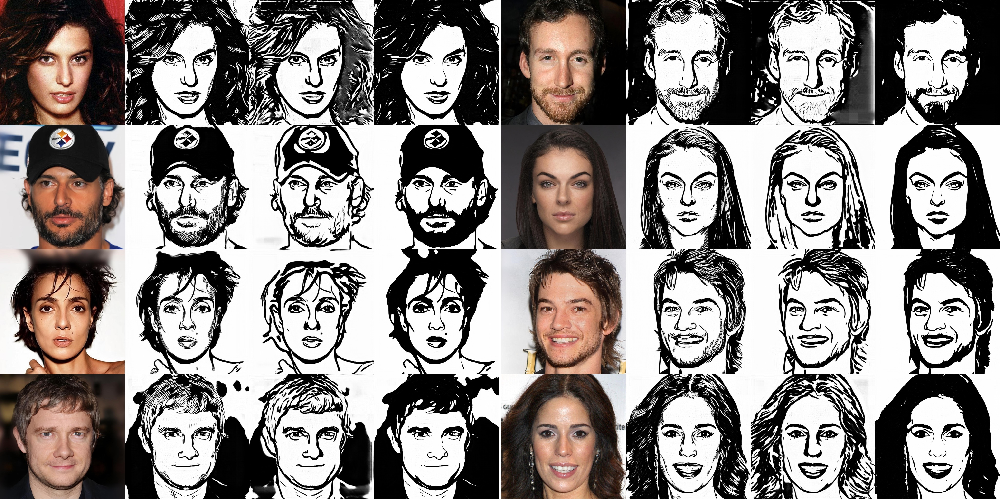
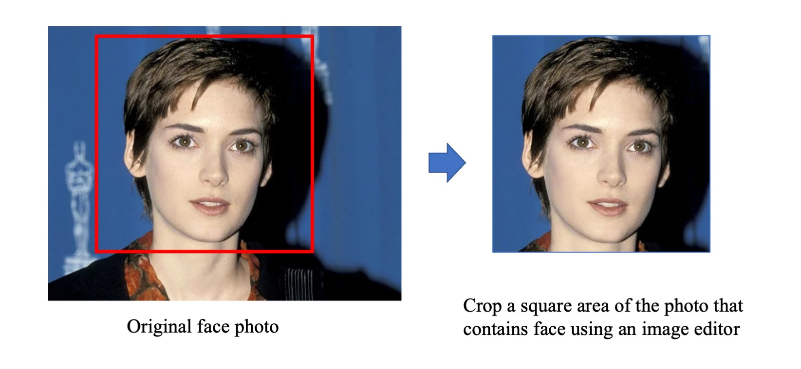
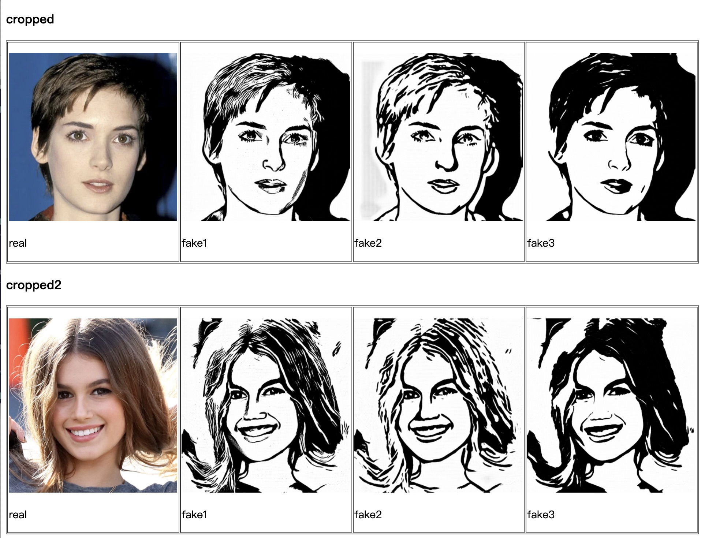

# Unpaired Portrait Drawing Generation via Asymmetric Cycle Mapping

We provide PyTorch implementations for our CVPR 2020 paper "Unpaired Portrait Drawing Generation via Asymmetric Cycle Mapping". [paper](https://openaccess.thecvf.com/content_CVPR_2020/papers/Yi_Unpaired_Portrait_Drawing_Generation_via_Asymmetric_Cycle_Mapping_CVPR_2020_paper.pdf), [suppl](https://openaccess.thecvf.com/content_CVPR_2020/supplemental/Yi_Unpaired_Portrait_Drawing_CVPR_2020_supplemental.pdf).

This project generates multi-style artistic portrait drawings from face photos using a GAN-based model.

[[Jittor implementation]](https://github.com/yiranran/Unpaired-Portrait-Drawing-Jittor)


## Our Proposed Framework
 


## Sample Results
From left to right: input, output(style1), output(style2), output(style3)


## Prerequisites
- Linux or macOS
- Python 3
- CPU or NVIDIA GPU + CUDA CuDNN


## Installation
- To install the dependencies, run
```bash
pip install -r requirements.txt
```

## Colab
A colab demo is [here](https://colab.research.google.com/drive/1U1fPXD1JukuKPOrhGMX1iaJC-d8_RUYr).

## Test steps (apply a pretrained model)

- 1. Download pre-trained models from [BaiduYun](https://pan.baidu.com/s/1_9Fy8mRpTQp6AvqhHsfQAQ)(extract code:c9h7) or [GoogleDrive](https://drive.google.com/drive/folders/1FzOcdlMYhvK_nyLCe8wnwotMphhIoiYt?usp=sharing) and rename the folder to `checkpoints`.

- 2. Test for example photos: generate artistic portrait drawings for example photos in the folder `./examples` using
``` bash
# with GPU
python test_seq_style.py
# without GPU
python test_seq_style.py --gpu -1
```
The test results will be saved to a html file here: `./results/pretrained/test_200/index3styles.html`.
The result images are saved in `./results/pretrained/test_200/images3styles`,
where `real`, `fake1`, `fake2`, `fake3` correspond to input face photo, style1 drawing, style2 drawing, style3 drawing respectively.



- 3. To test on your own photos: First use an image editor to crop the face region of your photo (or use an optional preprocess [here](preprocess/readme.md)). Then specify the folder that contains test photos using option `--dataroot`, specify save folder name using option `--savefolder` and run the above command again:

``` bash
# with GPU
python test_seq_style.py --dataroot [input_folder] --savefolder [save_folder_name]
# without GPU
python test_seq_style.py --gpu -1 --dataroot [input_folder] --savefolder [save_folder_name]
# E.g.
python test_seq_style.py --gpu -1 --dataroot ./imgs/test1 --savefolder 3styles_test1
```
The test results will be saved to a html file here: `./results/pretrained/test_200/index[save_folder_name].html`.
The result images are saved in `./results/pretrained/test_200/images[save_folder_name]`.
An example html screenshot is shown below:


You can contact email yr16@mails.tsinghua.edu.cn for any questions.

## Train steps

- 1. Prepare for the dataset: 1) download face photos and portrait drawings from internet (e.g. [resources](portrait_drawing_resources.md)). 2) align, crop photos and drawings & 3) prepare nose, eyes, lips masks according to [preprocess instructions](preprocess/readme.md). 3) put aligned photos under `./datasets/portrait_drawing/train/A`, aligned drawings under `./datasets/portrait_drawing/train/B`, masks under `A_nose`,`A_eyes`,`A_lips`,`B_nose`,`B_eyes`,`B_lips` respectively.

- 2. Train a 3-class style classifier and extract the 3-dim style feature (according to paper). And save the style feature of each drawing in the training set in .npy format, in folder `./datasets/portrait_drawing/train/B_feat`

A subset of our training set is [here](https://drive.google.com/file/d/1OSMOR3-uhGkoPwPFRNychJSNrpSak_23/view?usp=sharing).

- 3. Train our model
``` bash
sh ./scripts/train.sh
```
Models are saved in folder checkpoints/portrait_drawing


## Citation
If you use this code for your research, please cite our paper.

```
@inproceedings{YiLLR20,
  title     = {Unpaired Portrait Drawing Generation via Asymmetric Cycle Mapping},
  author    = {Yi, Ran and Liu, Yong-Jin and Lai, Yu-Kun and Rosin, Paul L},
  booktitle = {{IEEE} Conference on Computer Vision and Pattern Recognition (CVPR '20)},
  pages     = {8214--8222},
  year      = {2020}
}
```

## Acknowledgments
Our code is inspired by [pytorch-CycleGAN-and-pix2pix](https://github.com/junyanz/pytorch-CycleGAN-and-pix2pix).
